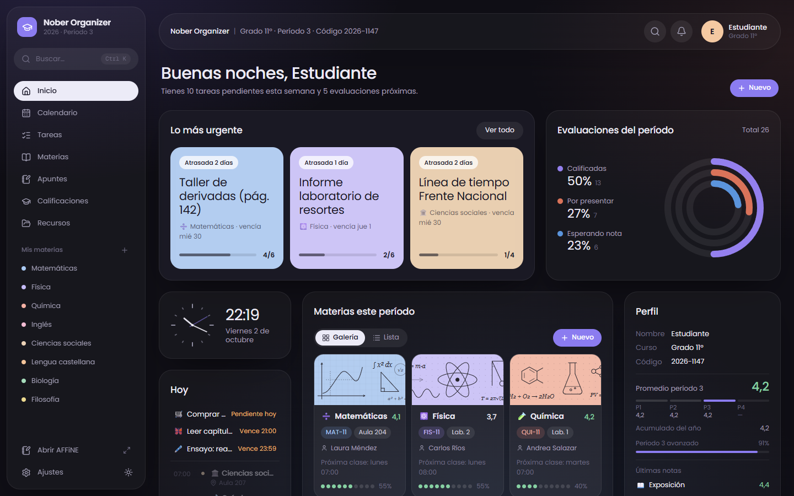
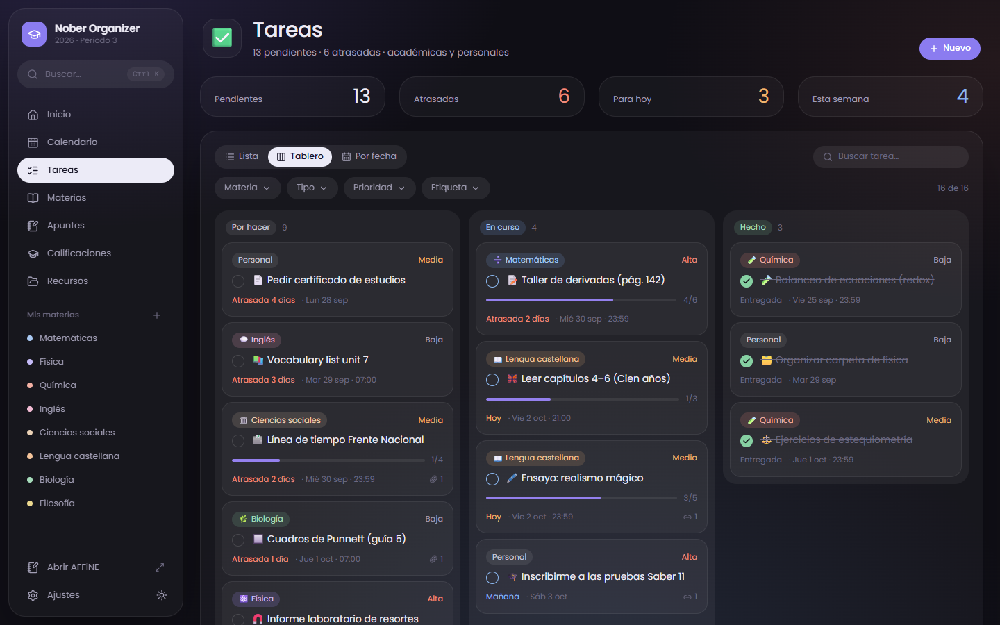
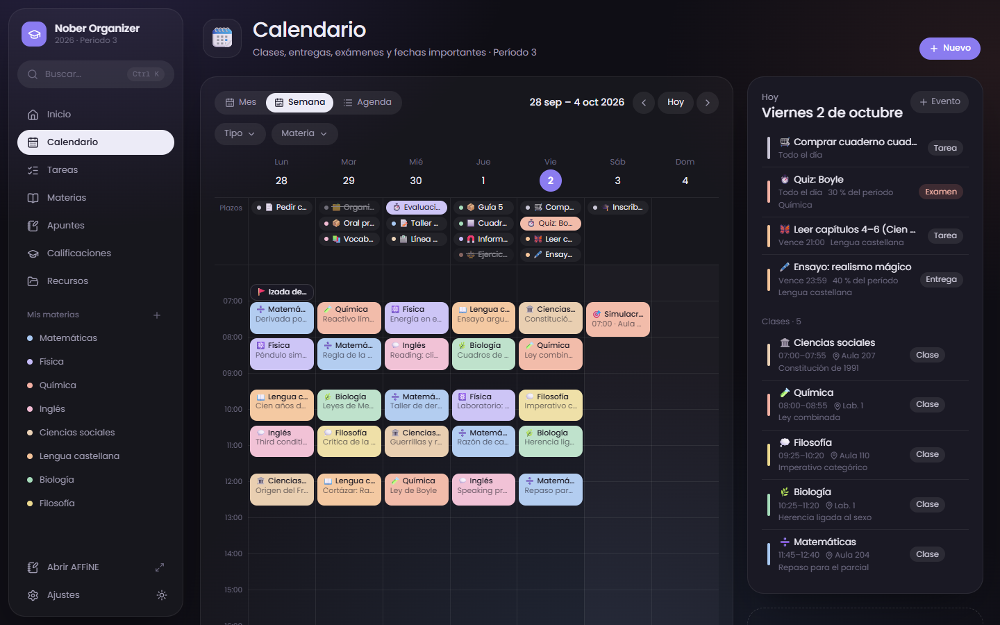
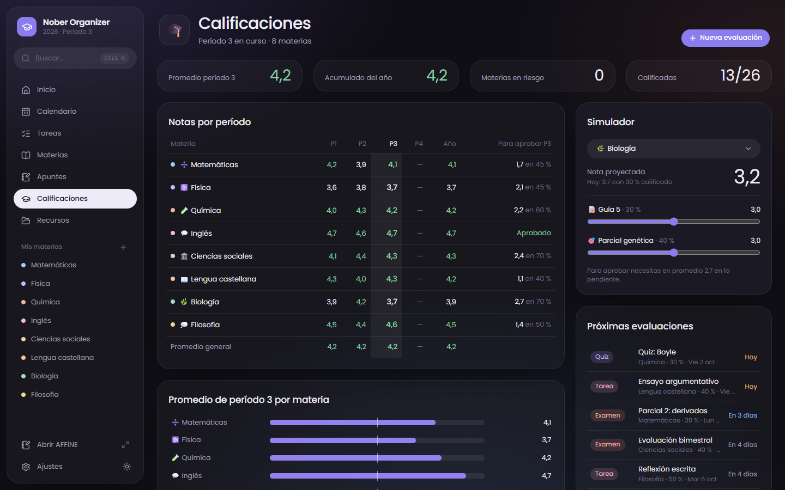
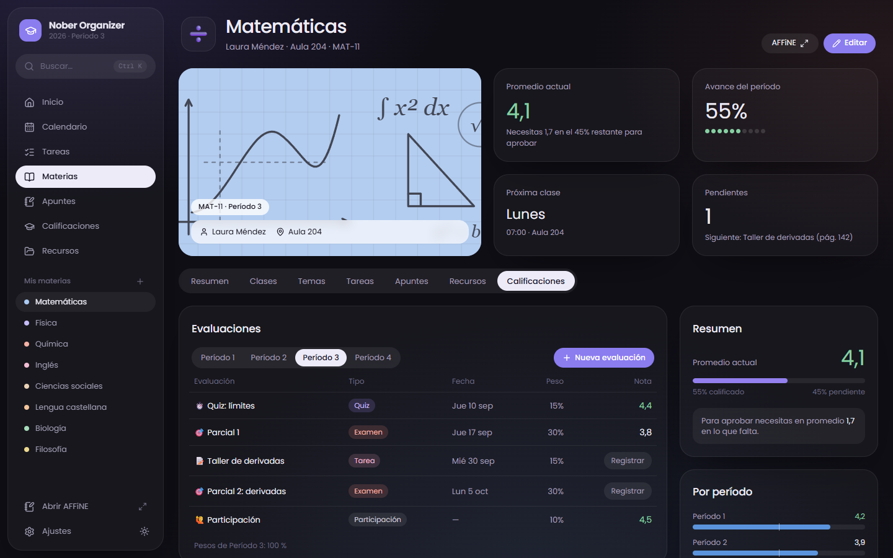

<a href="https://www.buymeacoffee.com/samons" target="_blank">
  
</a>

# Nober Organizer

**Organizador académico personal y de código abierto** para estudiantes de colegio: materias con horario,
tareas, calendario, calificaciones por períodos, temas, recursos y apuntes en [AFFiNE](https://affine.pro),
todo en un solo lugar. Interfaz en español (formato es-CO), modo oscuro y claro, y pensada también para móvil.

*Open-source personal school planner (courses, tasks, calendar, grades, notes in AFFiNE). The UI is in Spanish;
contributions to translate it are welcome.*



| Tareas (tablero) | Calendario (semana) |
| --- | --- |
|  |  |
| **Calificaciones** | **Materia** |
|  |  |

## Qué hace

- **Inicio**: lo más urgente, clases de hoy, tareas de la semana, entregas y evaluaciones próximas, promedio del
  período, temporizador de foco, metas y calendario del mes. Las cuentas nuevas tienen una guía de primeros pasos.
- **Materias**: color, portada, profesor, aula y **horario semanal** (el calendario genera las clases a partir de él).
  Cada materia tiene resumen, clases, temas (tablero por nivel de preparación), tareas, apuntes, recursos y notas.
- **Tareas**: lista, tablero (arrastrar y soltar) y por fecha; pasos, enlaces, etiquetas, prioridad y nota.
- **Calendario**: mes, semana y agenda con clases, entregas, exámenes, eventos y **festivos** (quitan las clases).
- **Calificaciones**: escala configurable (1.0–5.0 por defecto, aprueba con 3.0), períodos con peso, notas «sobre»
  otra escala (85/100 → 4,3), nota necesaria para aprobar y simulador.
- **Apuntes en AFFiNE**: cada clase enlaza su documento y se abre embebido en un panel, sin salir de la app.
  El contenido nunca se copia: vive en tu AFFiNE.
- **Cuentas**: correo y contraseña (y Google, opcional) con [Better Auth](https://better-auth.com). Cada usuario ve
  solo lo suyo; el registro se puede cerrar después de crear tu cuenta.

## Instalar en tu servidor (Docker)

Requisitos: un servidor con Docker y Docker Compose, y un dominio con HTTPS (nginx, Caddy, Cloudflare…).

```bash
git clone https://github.com/SamonsLol/nober-organizer.git
cd nober-organizer
cp .env.production.example .env.production   # completar: contraseñas, dominio, AFFiNE
docker compose --env-file .env.production up -d --build
curl -s http://127.0.0.1:3100/api/health     # {"ok":true,"db":true}
```

Luego publica `127.0.0.1:3100` con tu proxy (plantilla de nginx en [`deploy/nginx/nober.conf`](deploy/nginx/nober.conf)).
Guía completa —DNS, nginx, primer uso, actualizar y copias de seguridad— en [`deploy/README.md`](deploy/README.md).

### AFFiNE

Funciona con la nube de AFFiNE o con una instancia propia. Para que el panel embebido tenga sesión, lo ideal es
**autoalojar AFFiNE en el mismo dominio** que la app (p. ej. `notas.midominio.com` y `organizador.midominio.com`):
los navegadores bloquean las cookies de terceros dentro de un iframe. Variables:

| Variable | Qué es |
| --- | --- |
| `NEXT_PUBLIC_AFFINE_ORIGIN` | URL de tu AFFiNE (por defecto `https://app.affine.pro`) |
| `NEXT_PUBLIC_AFFINE_WORKSPACE` | ID del espacio: lo que va después de `/workspace/` en la URL de AFFiNE |

Se fijan al compilar la imagen: si las cambias, vuelve a ejecutar con `--build`.

## Desarrollo

Requisitos: Node 22 o superior y Docker (para PostgreSQL).

```bash
npm install
cp .env.example .env        # generar BETTER_AUTH_SECRET (el comando está en el archivo)
npm run db:up               # PostgreSQL 17 en localhost:5433
npm run db:migrate
npm run db:seed             # usuario demo@example.com / nober-demo-2026 con datos ficticios
npm run dev                 # http://localhost:3000
```

Sin `DATABASE_URL` la app arranca en **modo demostración** (datos ficticios en memoria, sin inicio de sesión):
útil para trabajar solo en la interfaz.

Otros comandos: `npm run lint` (TypeScript), `npm run build`, `npm run db:studio` (Prisma Studio).

### Stack

Next.js 16 (App Router, Server Actions) · React 19 · TypeScript · Tailwind CSS v4 · Prisma 7 + PostgreSQL ·
Better Auth · date-fns · lucide-react. Sin librería de componentes: el sistema de diseño es propio
(`src/app/globals.css` y `src/components/blocks`).

```
src/
  app/(app)/          pantallas (inicio, calendar, tasks, courses, notes, grades, resources, settings)
  app/api/            auth y health
  components/         vistas por pantalla, editores (diálogos) y bloques de diseño
  lib/actions/        Server Actions (validan con zod y filtran siempre por usuario)
  lib/data/           capa de datos: lee todo lo del usuario y deriva lo que pide cada pantalla
  lib/affine.ts       integración con AFFiNE, aislada en un módulo
prisma/               esquema, migraciones y seed
deploy/               plantilla de nginx y guía de despliegue
```

## Integraciones

- **AFFiNE por MCP** (0.27+): con un token del espacio, cada clase ofrece «Crear apunte», que crea el documento
  con una plantilla y lo enlaza. El token se guarda cifrado.
- **Google Calendar**: un calendario propio con clases recurrentes (sin festivos), tareas, evaluaciones y eventos,
  sin duplicados. Permiso mínimo: solo calendarios creados por la app.
- **Archivos**: sube PDF, documentos, imágenes, audio o video a tareas y recursos (solo su dueño puede verlos).
- **PWA**: instálala en el celular desde el navegador («Agregar a la pantalla de inicio»).

Configuración en [`deploy/README.md`](deploy/README.md#integraciones-opcionales).

## Hoja de ruta

- Recordatorios (notificaciones push) de entregas y exámenes.
- Leer otros calendarios de Google en solo lectura.
- Exportar e importar datos.
- Traducción de la interfaz.

## Contribuir

¡Bienvenidas las contribuciones! Lee [`CONTRIBUTING.md`](CONTRIBUTING.md). Para errores de seguridad, no abras un
issue público: escribe a la persona que mantiene el proyecto.

## Licencia

[MIT](LICENSE). El diseño y el código son propios; la organización del contenido se inspira en plantillas
académicas de Notion, sin relación con sus autores.
